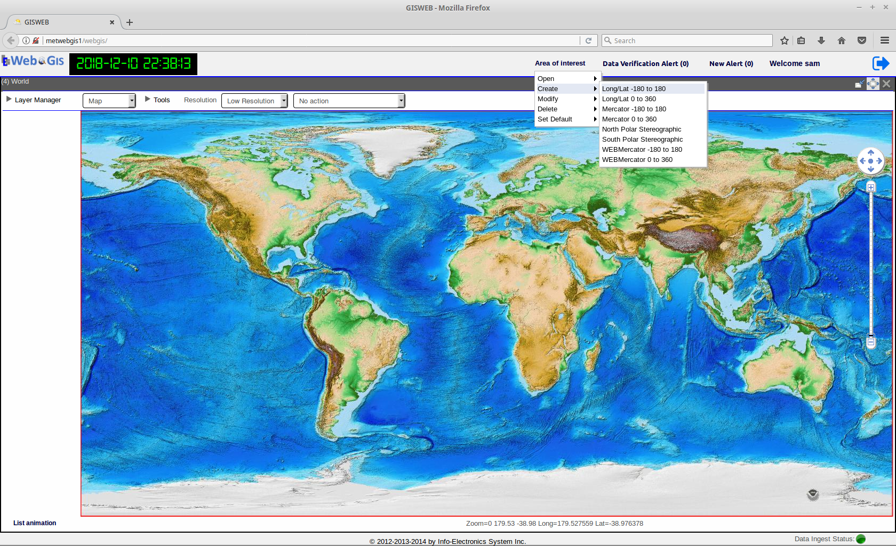
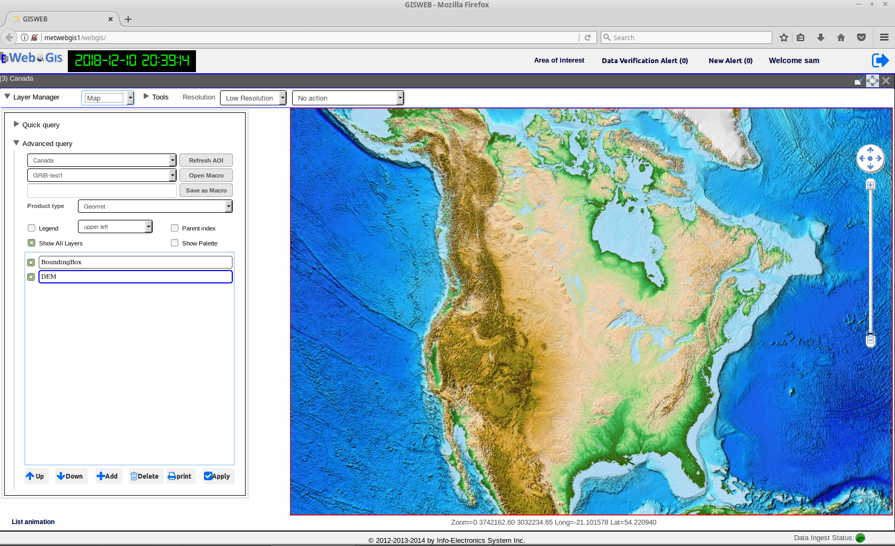

Area of Interest Management
===========================

Area of Interest or AOI is the area of a map region, on which geo-referenced data are of concern to the user. 
In WebGIS, the AOI is defined by its map location and extent expressed in latitude, longitude coordinates.
and its map projection.  
All the AOI's are to be used with the Map application module. WebGIS software already comes with a set of pre-defined AOI's
which can be found in the Area of Interest Management Tool.

The Area Of Interest Management Tool also provide user with a very user-friendly way to create, modify, delete, set as default an Area Of Interest for use in the Map Module.
As shown in the figure below, there are four menu items found in the Area of Interest Management Tool: *Create, Modify, Delete, Set Default.*

   The four menu items under Area Of Interest Management Tool: *Open, Create, Modify, Delete, Set Default.*

The list of all the available AOIs can be found by clicking on the *Open* menu item. The AOI with an asterisk(*) beside its name indicates it is the default AOI.
By clicking on any AOI from the list, it will open the selected AOI in the Map module ready for use.

Creating an Area of Interest
****************************

At the top of the WebGIS Main Window, click on **Area of Interest** and select **Create** from the menu. Under the **Create menu**, select the type of base map to choose from.
As shown in the previous figure, the types of base maps available are:

*  **Long/Lat -180 to 180**
*  **Long/Lat 0 to 360**
*  **Mercator -180 to 180**
*  **Mercator -180 to 180**
*  **North Polar Stereographic**
*  **South Polar Stereographic**
*  **WEBMercator -180 to 180**
*  **WEBMercator 0 to 360**

Each base map type has its own projection and extent that provides the basis for your new AOI. 
For example **Long/Lat -180 to 180** has Long/Lat projection extending from -180 to 180 degrees longitude,
and **North Polar Stereographic** has the polar stereographic projection at the North Pole.
Select the one appropriate to your AOI.
You will then be presented withh the AOI Creation Tool as shown below.

.. figure:: images/aoi_management_create_new1.png

   GUI of the tool to create an AOI

.. table:: Description of the AOI Creation Tool 
   :align: left

   =========  ===========================================================
     no.      component description
   =========  ===========================================================
   **1**      **Name**
   **2**      **Projection String**
   **3**      **Extent of AOI expressed as Lat/Long**
   **4**      **Preview/Return Button**
   **5**      **Publc Enabled Checkbox**
   **6**      **Save Button**
   **7**      **Date Line Crossing Indicator**
   **8**      **Graticule Selection Radio Buttons**
   =========  ===========================================================

First, enter a name for the AOI in the text field **Name**.
Click on a point on the map and hold and start dragging the mouse. A rectangular bouding box will start to be drawn as you drag.
This box drawn will become the Area of Interest that you are defining. When you release the mouse button, 
it will stop drawing and the resulting bounding box is your Area of Interest.  The extent of the drawn AOI expressed as latitude and longitude will appear 
in the text fiels on the AOI Creation Tool panel on the left.  
Optionally, you can further adjust the extent by modifying those latitude and longitude values in the text fields manually, or you can re-draw the bouding box 
with your mouse again on the map until it is to your liking.
When you're done defining your AOI's bounding box, click on the **Preview Button** to see a preview of your AOI.
When satisfied, click on **Save** to save the AOI, if not, click on the **Preview/Return Button** to return back to the base map.
Optional inputs such **Graticule radio buttons** can be used to add grid lines to the AOI.

Modifying and Deleting an Area Of Interest
******************************************

To modify an existing AOI, select the **Modify** menu item and under it, select the AOI to be modified. The AOI will be opened in the same tool that is used for creating an AOI.
The extent of the AOI can then be modified and saved back to the AOI.

To delete an existing AOI, select the **Delete** menu item and under it, select the AOI to be deleted. The selected AOI will then be removed from the list of available AOI's.

Setting the Default Area of Interest
************************************

The default AOI is the AOI that is loaded by Layer Manager in the Map module whenever the user logs in to WebGIS.
To set an AOI as the default, simply select the **Set Default** menu item and under it, click on the AOI that needs to be set as the default.

The list of all the AOI's created through Area Of Interest Management Tool are also shown and made available in the Advanced Query dialog within the Layer Manager.
To refresh the display with a new AOI in the Map Module, in the Advanced Query dialog select from the AOI drop-down list the desired AOI and clicked on the 
**Refresh AOI Button**. 

   
   WebGIS opened with the default AOI set to Canada

