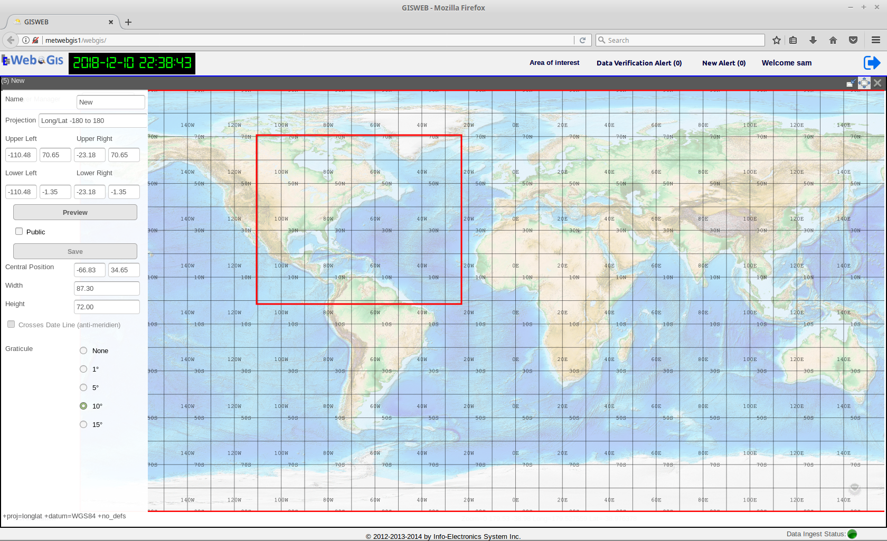

Area of Interest Management
===========================

Area of Interest or AOI is the area of a map region, on which geo-referenced data are of concern to the user. 
In WebGIS, the AOI is defined by its map location and extent expressed in latitude, longitude coordinates.
and its map projection.  
All the AOI's are to be used with the Map application module. WebGIS software already comes with a set of pre-defined AOI's
which can be found in the Area of Interest Management Tool.

The Area Of Interest Management Tool also provide user with the ability to create, modify, delete, set as default an Area Of Interest for use in the Map Module.
As shown in the figure below, there are four menu items found in the Area of Interest Management Tool: *Create, Modify, Delete, Set Default.*

   The four menu items under Area Of Interest Management Tool: *Open, Create, Modify, Delete, Set Default.*

The list of all the available AOIs can be found by clicking on the *Open* menu item. The AOI with an asterisk(*) beside its name indicates it is the default AOI.
By clicking on any AOI from the list, it will open the selected AOI in the Map module ready for use.

Creating an Area of Interest
****************************

   GUI of the tool to create an AOI  

Modifying and Deleting an Area Of Interest
******************************************

To modify an existing AOI, select the **Modify** menu item and under it, select the AOI to be modified. The AOI will be opened in the same tool that is used for creating an AOI.
The extent of the AOI can then be modified and saved back to the AOI.

To delete an existing AOI, select the **Delete** menu item and under it, select the AOI to be deleted. The selected AOI will then be removed from the list of available AOI's.

Setting the Default Area of Interest
************************************

The default AOI is the AOI that is loaded by Layer Manager in the Map module whenever the user logs in to WebGIS.
To set an AOI as the default, simply select the **Set Default** menu item and under it, click on the AOI that needs to be set as the default.

The list of all the AOI's created through Area Of Interest Management Tool are also shown and made available in the Advanced Query dialog within the Layer Manager.
To refresh the display with a new AOI in the Map Module, in the Advanced Query dialog select from the AOI drop-down list the desired AOI and clicked on the 
**Refresh AOI Button**. 

   
   WebGIS opened with the default AOI set to Canada
