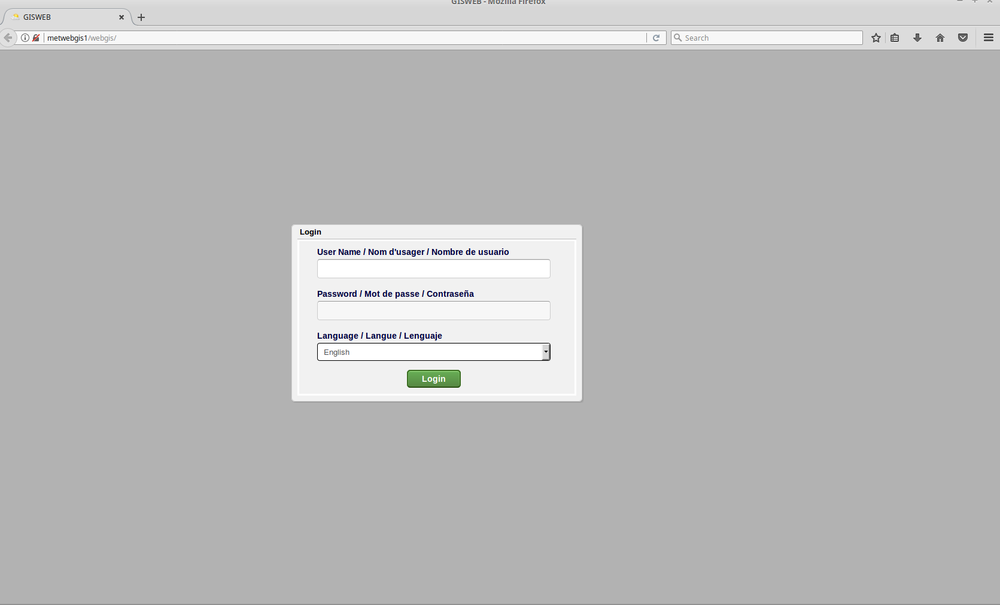
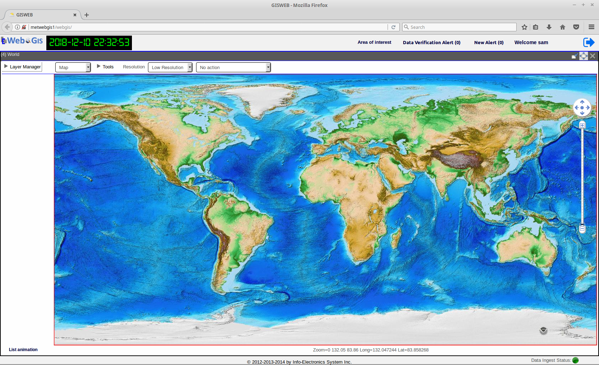
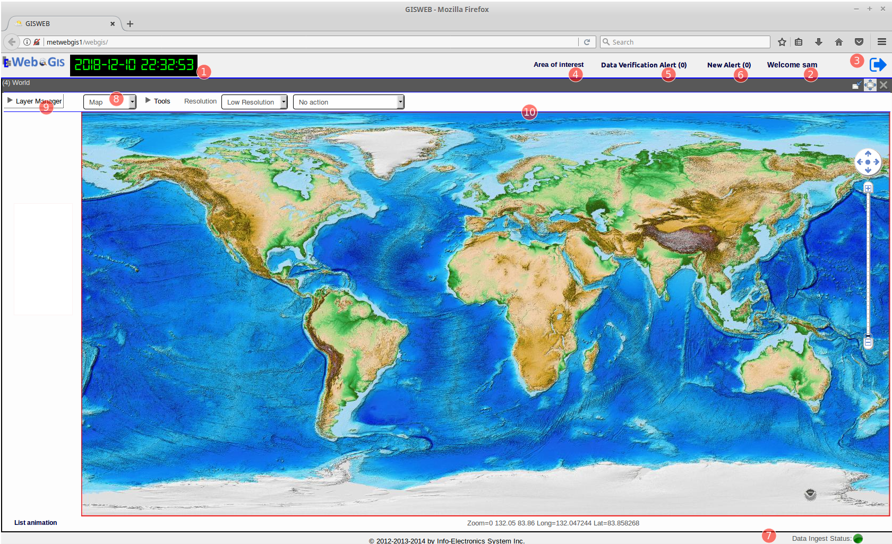
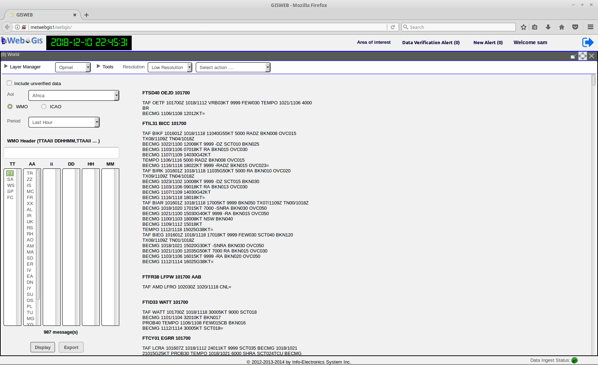

Graphical User Interface Overview
=================================

Logging In and Out
------------------

To access the WebGIS application, launch a browser from any computer connected to the same local network as the WebGIS server and open it with following URL:

.. code-block:: bash

   http://[hostname]/webgis

 
where ``[hostname]`` is to be replaced by the hostname or IP address of the WebGIS server. Any modern internet browser such as Firefox or Chrome is recommended.
When first opened with this URL, the browser will present you with Login page of WebGIS shown below.

   
   The WebGIS login page

To log in, enter the User Name and Password provided to you by the system adminstrator.
Optionally, select the language supported by the Graphical User interface, and click on the Login button.
The default is English if no selection is made.

Upon successful login, the application will bring you to the main application display as shown below.

   The main page after logging in

The Logout button is located at the upper-right corner. Once you've finished your session with WebGIS, 
you should log out of the application by clicking on this button. 
User whose session is still active has to log out before they can log in again from a different client browser.
The login and logout times of an user is always being recorded by the application in the logs.  

Overview of the Main Display Window
-----------------------------------

Upon first logging in, the main display window as shown below will be presented. 
By default, it is the Map application module being displayed in the main display window after logging in.

   Main Display Window showing the Map module. See table below for the descriptions of the numbered components.
   
.. table:: Interface Description
   :widths: 8 50
   :align: left

   =========  ===========================================================
     no.      component description
   =========  ===========================================================
   **1**      **UTC Time Clock**                                          
   **2**      **User Name Display**                                      
   **3**      **Logout Button**                                            
   **4**      **Area Of Interest Management Tool**
   **5**      **Data Verification Panel Toggle**
   **6**      **New Alert Panel Toggle**
   **7**      **Status Bar**
   **8**      **Application Module Selector**
   **9**      **Layer Manager**
   **10**     **Main Data Display Pane**
   =========  ===========================================================

The **Application Module Selector** indicates the module in which the WebGIS is currently running.
As seen in the above screen capture, upon first logging in, by default it is always set to be in the Map module mode, as
it is a key module in WebGIS which allows the visualization of all kinds of geo-spatial data that are presentable on a projected map. 
In the Map module mode, the center of the user interface, which is Main Data Display Pane, almost always display a map of an Area of Interest(AOI).
In this case, the default AOI is a world map. For topics related to creating and setting the default AOI, please go to Chapter 2.  
The **Layer Manager** is a component that controls the display when WebGIS is running in the Map module mode.
For the complete documentation on the Map application module, please go to Chapter 2.

The **Application Module Selector** is a drop-down selector list that contains a list of the different modules that WebGIS supports.
The current list of modules are Map, OPMET, Graph, and Profile.  Besides the Map module, 
the other modules provides data visualization and analysis tools that do not need mapping visualization. 
By clicking on the drop-down list and select the desired application module with work with, the content of the Main Data Display Pane changes 
accordingly with respect to the currently selected module;
for example, in the Map module, the Main Data Display Pane always displays a map background, where as for the OPMET module, it changes to a Text Pane
used for displaying Alpha-numeric data as show in the figure below. For more details on the various WebGIS application modules, please refer to the subsequent Chapters.

   WebGIS's GUI with the Opmet application module selected. 

The UI components **1-8** are common components that provides useful information and functionalities and 
appear all the time on the WebGIS GUI regardless of which module is currently selected.
