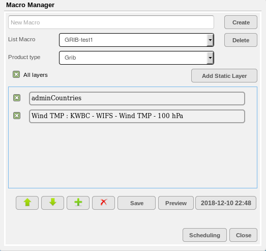
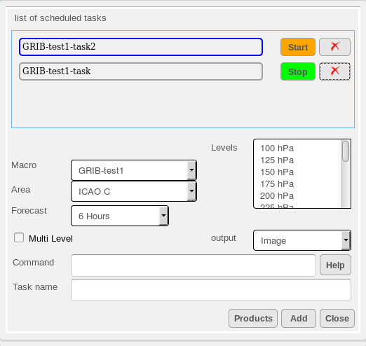

Macros and Task Scheduling
===========================

The concept of Macros is to allow user to simplify a multi-step process when creating a map product into a single step.

Normally, when a user creates a map product, it requires multiple steps such as selecting the product types, adding the layers,   
select the rendering methods for each layer, customizing the display preferences for each layer.

A macro can be created to save all these steps into a single encapsulation and can be called upon any time in the future.
This enables recurring products to be created accurately for display with a single call to the macro and saves the user the time
in creating the product every time.

Together with user-defined macros, the **Task Scheduling** function provides further convenience to user
by allowing tasks to be scheduled to execute the macros on a periodic basis. This allows automatic and periodic generation of map products
that are readily accessible by users without the need to manually execute the macros every time.

The Macro Manager is the dialog that provides all the tools for user to manage user-defined macros and it is launched from the Layer Manager. 
In the Layer Manager, expand the Advanced Query dialog and click on the **Open Macro** button and the Macro Manager will appear as shown below.

   The Macro Manager

.. table:: Macro Manager Description
   :widths: 8 50
   :align: left

   =========  ===========================================================
     no.      component description
   =========  ===========================================================
   **1**      **Macro List**
   **2**      **Macro Name Field**
   **3**      **Logout Button**
   **4**      **Area Of Interest Management Tool**
   **5**      **Data Verification Panel Toggle**
   **6**      **New Alert Panel Toggle**
   **7**      **Status Bar**
   **8**      **Application Module Selector**
   **9**      **Layer Manager**
   **10**     **Main Data Display Pane**
   =========  ===========================================================

Creating a Macro
*****************

Running a Macro
***************

Scheduling a Task to Run a Macro
********************************

The Task Scheduling dialog is launched from the Macro Manager by clicking on the **Scheduling Button**. 

   The Macro Manager

