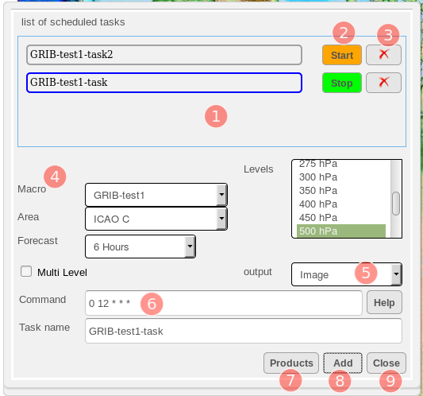

Macros and Task Scheduling
===========================

The concept of Macros is to allow user to simplify a multi-step process when creating a map product into a single step.

Normally, when a user creates a map product, it requires multiple steps such as selecting the product types, adding the layers,   
select the rendering methods for each layer, customizing the display preferences for each layer.

A macro can be created to save all these steps into a single encapsulation and can be called upon any time in the future.
This enables recurring products to be created accurately for display with a single call to the macro and saves the user the time
in creating the product every time.

Together with user-defined macros, the **Task Scheduling** function provides further convenience to user
by allowing tasks to be scheduled to execute the macros on a periodic basis. This allows automatic and periodic generation of map products
that are readily accessible by users without the need to manually execute the macros every time.

The Macro Manager is the dialog that provides all the tools for user to manage user-defined macros and it is launched from the Layer Manager. 
In the Layer Manager, expand the Advanced Query dialog and click on the **Open Macro** button and the Macro Manager will appear as shown below.

.. figure:: images/macro_manager.png
   :width: 350   

   The Macro Manager

.. table:: Macro Manager Description
   :widths: 8 50
   :align: left

   =========  ===========================================================
     no.      component description
   =========  ===========================================================
   **1**      **New Macro Name**
   **2**      **Macro List**
   **3**      **Product Type Selector**
   **4**      **Layers List Box**
   **5**      **Create Macro Button**
   **6**      **Save Macro Button**
   **7**      **Delete Macro Button**
   **8**      **Close Dialog Button**
   **9**      **Schedulgin Button**
   =========  ===========================================================

Creating a Macro
*****************

Creating a macro involes steps that are very much similar to creating a product using the Layer Manager,
such as choosing the layers of product types to be included in the map product, and eventually adding the layers to include into the macro.
As seen in the previous figure, part of the **Macro Manager** looks like the Layers List Box in the **Layer Manager**, 
which also allows user to add, remove and order the layers being generated in the macro product.

On the **Macro Manager**, enter a name in the field **New Macro Name** for the macro to be created.
Select from the **Product Type** drop-down list the type of layer to add, click on the **+ Button** to add the layer and it will appear in the List Box below.
Repeat this step for additional data layers to include in your macro. For static layers, use the **Add Static Layer Button**.
When you're done with adding all the layers for your macro, click on the **Create Button** to create the macro.
At this point, the macro is created and saved in the macro list and and will be available for use in the future.

For modifying an existing macro, simply select the macro from the **Macro List**, modify the layers using the buttons below the Layers List Box, 
then click on the **Save Macro Button**. The modifications will then be saved to the specific macro and be available for future use.

Running a Macro
***************
A macro can be run from either the **Quick Query Dialog** or the **Advanced Query Dialog** in Layer Manager.
Please see the section on **Quick Query Dialog** on how to run the macro from there.
To run from the **Advanced Query Dialog**, select the macro from the drop-down list beside the **Open Macro Button**,
the **Macro Manager** appears. Then from the **Macro Manaager**, click on the **Preview Button**, and the product will appear on the map, 
with the proper layers appearing in Layer Manager.

Scheduling a Task to Run a Macro
********************************

The Task Scheduling dialog is launched from the Macro Manager by clicking on the **Scheduling Button**.
The result of a scheduled task is always a generated product pertaining to an pre-defined macro, 
and in the form of an exportable file format such as PNG or PDF.

   The Task Scheduling Dialog

Examples command schedule                                        

.. table:: Scheduled Tasks Dialog
   :widths: 8 50
   :align: left

   =========  ===========================================================
     no.      component description
   =========  ===========================================================
   **1**      **List of Scheduled Tasks**
   **2**      **Start/Stop Toggle Button**
   **3**      **Delete Task Button**
   **4**      **Macro Selection Area**
   **5**      **Output Format**
   **6**      **Command Schedule**
   **7**      **Products List Button**
   **8**      **Add Task Button**
   **9**      **Close Dialog Button**
   =========  ===========================================================

The **List of Scheduled Tasks** contains the list of all the existing tasks that have been previously defined by the user.
Beside the name of each task, the **Start/Stop Toggle Button** is used to enable and disable the schedule tasks;
tasks are only scheduled to run when this button is **green** in colour. 
Clicking on this button toggles the starting and stopping of the scheduled task. 
When the task is disabled, the button will be **orange** in colour and the task will not be scheduled to run.
To delete a task completely, click on the **Delete Button** beside its name.

The **Macro Selection Area** contains input entries for the specifics of the product generated by the task.
The input entries include the Macro to run the task with, the AOI on which to generate the product, the Forecast Hours of the generated product, 
and the Level of the generated product.

The **Output Format** allows user to select the format of the output files which can either be an Image(PNG) or PDF.

The input text field **Command Schedule** is where the schedule is defined for the execution of a task.
The input uses the Linux Cron schedule format, a format that is extensive and flexible in defining time and frequency of launching an action.
As examples, the input below defines the schedule to be at 12:15 UTC every day

.. code-block:: bash

   15 12 * * * 

where as the input below defines the schedule to be every 15 minutes during the 10th hour of every Monday

.. code-block:: bash

   */15 10 * * Mon 

For further description on the format, click on the **Help Button** beside it for details.

To schedule a new task, enter a name in the field **Task Name**, and click on the **Add Task Button** and it will appear in the list on top.

 
