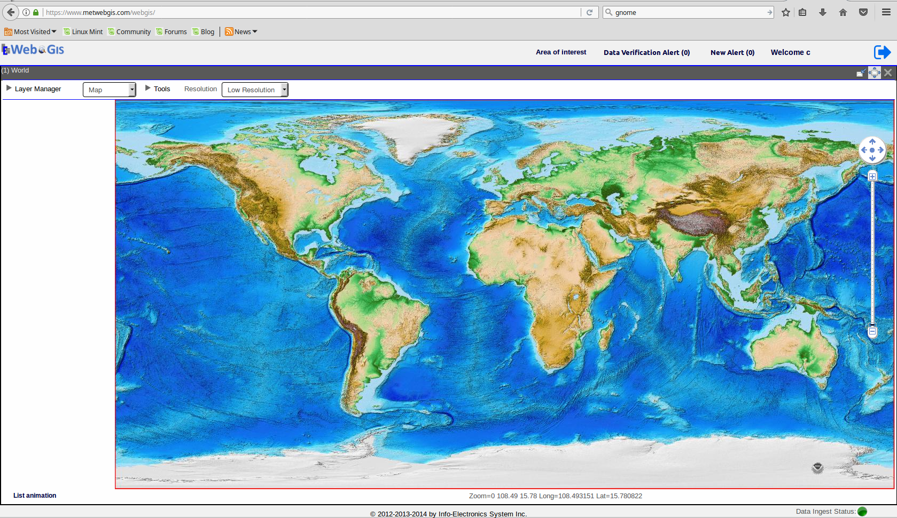

Map
===

   This is the caption of the figure (a simple paragraph).

To deploy a new version of MetWebGIS, you will need the WAR file containing the application.
The WAR file needs to be deployed in an Tomcat instance.
To do so, the easiest way is to use the HTML Manager of Tomcat.
