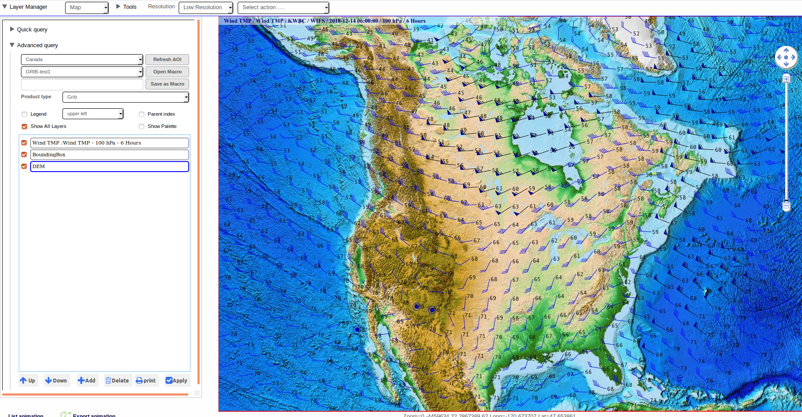
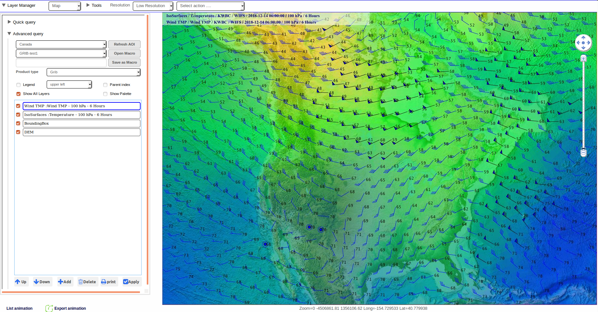
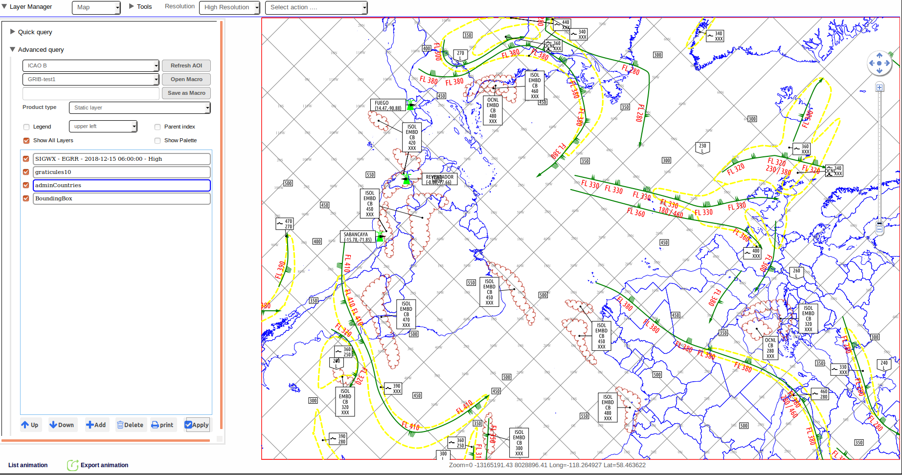
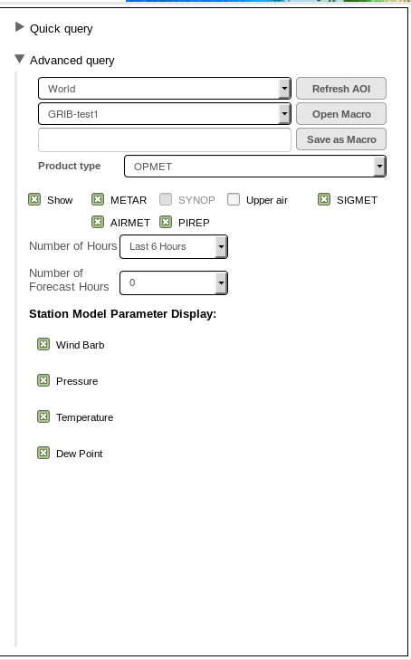
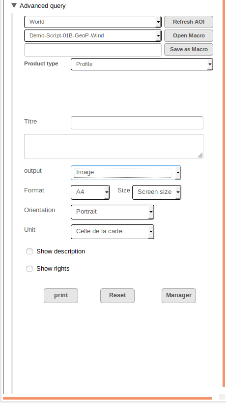

Map
===

The Map application module is the key module that provides the essential web-mapping visualization capabilities to the WebGIS software.
The main functionalities provided by the Map module include:

* Providing easy-to-use navigation over maps of pre-defined areas of interest.
* Visualizing various geo-spatial data and meteorological products on a projected map.
* Organizing the different mapped GIS data as layers and providing user-friendly interactivity for managing and customizing their display.
* Providing different methods of rendering(such as isolines and filled-contours) of the data layers and geo-spatial data.

The Basics
**********

Layer Manager
-------------

The main components of the Map module consists of the **Layer Manager** and the **Main Data Display Pane**.
The Layer Manager is the component the user interacts with to control what data to display and how to display
on the Main Data Display Pane.

.. figure:: images/map_layermanager1.png
   :width: 300   

   Layer Manager with Advanced Query open and Layers List Box pre-loaded with the default layers, DEM and Bounding Box.

.. table:: Interface Description
   :widths: 8 50
   :align: left

   =========  ===========================================================
     no.      component description
   =========  ===========================================================
   **1**      **Layers List Box**
   **2**      **Product Type Selector**
   **3**      **Add Layer Button**
   **4**      **Apply Display Button**
   **5**      **Delete Layer Button**
   **6**      **AOI Selector & AOI Refresh Button**
   **7**      **Layer Up/Down Buttons**
   **8**      **Show All Layers Toggle**
   **9**      **Quick Query/Advanced Query Toggle**
   =========  ===========================================================

The Layer Manager serves as the control centre for user to query data layers and manages the layers displayed on the Main Data Display Pane.
As layers are added, they appear in a ordered list in the Layers List Box. All the layers appearing in the List Box are displayed as overlay layers.

The order in which the layer appears in the Layers List Box directly represents the order at which the layer is being rendered on the Main Data Display Pane.
The bottom-most layer in the List Box is the layer rendered on the background layer; the next layer up in the List Box , when rendered on the Display Pane, 
is overlaying over the previous layer; and the top-most layer in the List Box is the layer rendered as the foreground layer. 
The **Layer Up/Down Buttons** allows user to move the selected layer up or down as to alter its overlay order when rendered on the Main Data Display Pane.

Main Data Display Pane
----------------------

The Main Data Display Pane is the display area on which mapped data are presented.
Upon first log-in, it is always displays a map of the default Area Of Interest since the Layer Manager is by default pre-loaded 
with the DEM layer corresponding to this default Area of Interest. To learn how to change the user default Area Of Interest, please see Chapter 3.

Panning and zooming over the Area Of Interest is provided to the user for easy navigation and observation of the map.
Scrolling the mouse wheel up and down allows zooming-in and out of the map region, while clicking-and-dragging on the map provides panning of the region.
Alternatively, you can use the Map Navigation Control located on the right side of the map for zooming and panning. Clicking on the + and - is zooming
in and out respectively and clicking on an arrow key is panning the map in the respective direction by one step.

Adding Static Layer
-------------------

As mentioned earlier, the Layer Manager is pre-loaded with two default layers: the DEM and Bounding Box.
Both of these layers are static layers, which are geo-referenced layers that do not contain any temporal data.

To add a static layer to the display, use the **Product Type Selector** to select *Static Layer* as the Product type 
and click on the **Add Layer Button**. The Add Static Layers dialog appears. All the available static layers will be listed in this dialog.
Select the one to be added, and click Add. The added static layer will appear in the **Layers List Box** together with the other two default layers.
To refresh the display of all the static layers on the **Main Data Display Pane**, click on **Apply Display Button**.
 
.. figure:: images/static_layers_dialog.png
   :width: 150

Adding GRIB Layer
*****************

To add a new GRIB data layer, using the **Product Type Selector**, select GRIB as the Product type and click on the **Add Layer Button**.
The following GRIB Layer dialog appears. The GRIB Layer dialog allows you to specific precisely the parameter type, run time, forecast time, level of the GRIB data,
as well as the rendering type of the data layer. 

.. figure:: images/grib_layer_dialog.png
   :width: 300
  
   The GRIB Layer Dialog

Similar to adding a static layer, once the GRIB data details(Source, Model, Run time, Level, Forecast Time, Parameter, Rendering type) are selected from the dialog, 
click on **Add** to add the layer to Layer Manager. The newly select layer should appear in the **Layers List Box**.
Then, to render the display of the newly added layer, click on the **Apply Display Button** in Layer Manager.  Note that the GRIB Layer Dialog will stay open, to allow 
the user to select additional GRIB data layers to be added as overlay.  When done with adding GRIB layer, you can close the dialog by clicking on the **X Button**.

As describe above, in general the process of adding a data layer of any **Product Type** onto the map for display is similiar and always involves three stages:

#. From Layer Manager, select the **Product Type** to be added.

#. Click on **Add Layer** button to launch a dialog for making data selection. (In this case, the GRIB Layer Dialog allows user to select the specifics of the GRIB layer.)

#. Once the layer is added to Layer Manager, click on *Apply Dispaly Button* to refresh the display.

  
   Map Product with one GRIB Wind Temperature Layer

Different Rendering Types
-------------------------
Note that in the GRIB Layer Dialog, there is a selector for Rendering Type. For most parameter types of GRIB, three rendering types are available: 
*Isolines, IsoSurfaces and Points.*  For the parameter types related to wind data, additional rendering type such as Wind TMP, Wind Barbs, Streamlines are also available.

  
   Map Product with two layers of GRIB data: Temperature rendered as Iso-surface, and Wind as Wind Barbs

Adding SIGWX Layer
******************

To add a new SIGWX data layer, using the **Product Type Selector**, select SIGWX as the Product type and click on the **Add Layer Button**.
The following SIGWX Layer dialog appears.  

.. figure:: images/sigwx_layer_dialog.png
   :width: 300

   The SIGWX Layer Dialog

From the SIGWX Layer Dialog, select the specifics(Source, Reference Time, Forecast Time, Levels) of the SIGWX data to be added.
In the lower part of the dialog, there are checkboxes for each SIGWX feature. By default, all of them are checked, indicating
all SIGWX features will be displayed. To filter out specific feature from the SIGWX data display, 
click to un-check the box beside the particular feature

Once the selection of the SIGWX data is done, click on the **Add Layer Button** to add the layer to Layer Manager,
and the selected SIGWX layer should appear in the **Layers List Box**. 

Lastly, click on the **Apply Layer Button** in Layer Manager to refresh the map display with this new layer.

  
   Map Product with one SIGWX Layer using the ICAO Area B as Area Of Interest

Showing PNG of ICAO Charts
--------------------------

For SIGWX data over the standard ICAO Areas, the PNG images of these charts are also being disseminated by WAFS.
There is a function available from the SIGWX Layer Dialog that can optionally show the PNG image of these standard ICAO SIGWX Charts.
To open the PNG image for display, click on the **Show PNG Button** on the SIGWX Layer Dialog.
Please note that the PNG Chart is only available on the standard ICAO Areas; 
the user has to set the current AOI to one of the ICAO Areas in order to launch the PNG image for display.

Adding Opmet Plotting
*********************

OPMET data plotting such as station models can also be displayed as overlay on top of other map data layers.
To overlay OPMET data plotting on the map, in the **Product Type Selector** , select OPMET
and the following selection panel will appear in the Layer Manager.  Unlike data layers of other product type, 
OPMET layer does not appear in the **Layers List Box** as the display of OPMET data plotting is on the top-most layer.

In the data selection panel, there is a list of checkboxes represening the types of OPMET data available for display: 
METAR, SYNOP, UPPER AIR, SIGMET, AIRMET, PIREP.
Simply click to check on the types to be added for displayed, then select the **Number of Hours** which is the number of hours to include in the past, 
and select **Number of Forecast Hours**, and lastly click on the **Show** checkbox to start the data query. This will initiate the query to the database
for the specific OPMET data within the time period specified and display them on top of the map.

   OPMET Data Selection Panel under the Advanced Query Dialog

.. figure:: images/opmet_station_models1.png
   :width: 500

   Display of Station Models on the Map

.. figure:: images/opmet_sigmet_area1.png
   :width: 500

   Display of SIGMET area on the Map

.. figure:: images/opmet_sigmet_rawdata1.png
   :width: 500

   Display of the raw bulletin upon clicking on the SIGMET area

Quick Query Dialog
******************

By default, upon first login, the **Layer Manager** opens with the **Advanced Query Dialog** expanded while keeping the **Quick Query Dialog** in the collapsed state.
The **Quick Query Dialog** is located above the Advanced Query Dialog and is in the collapsed state whenever the Advanced Query Dialog is expanded.
Only either one of two dialogs can be used at one time. To use the **Quick Query Dialog**, click on the arrow next to the **Query Query** label to expand it. This also toggles
the Advanced Query dialog to collapse. 

In general, the **Quick Query** is compact and customized version of the **Advanced Query Dialog** and provides a subset of query functionalities available from the Advanced Query.
It is intended to provide a easy and quick way to query the most common types of WAFS products for display on the Map, 
while any data queries done using the Quick Query Dialog can also be done already with the Advanced Query Dialog.

.. figure:: images/layer_manager_quick_query_grib.png
   :width: 350    

   The Quick Query Dialog 

.. table:: Interface Description
   :widths: 8 50
   :align: left

   =========  ===========================================================
     no.      component description
   =========  ===========================================================
   **1**      **Area of Interest Selection**
   **2**      **Products Selection**
   **3**      **List of Static Layers**
   **4**      **Macros Selection**
   **5**      **Display Button**
   =========  ===========================================================

As seen on the **Quick Query Dialog**, there three sections for user input: **Area of Interest**, **Products**, **Macros**
The **Area of Interest** allows user to specify the combination of **Source/Model** and **AOI** of the data.
For the sections **Products** and the **Macros**, user can only choose to use either one; hence, when **Products** is open, 
the **Macros** section will be closed, and vice versa.
Under **Products**, the user can choose to display either GRIB(WIND TMP) or SIGWX of a specific Level and Forecast Time.
When **Macros** is open, the user is simply presented with a drop-down list containing all the user-defined macros to select from.
For more details on how to create a macro, please see the Chapter on Macros and Task Scheduling.
Once these data selections are made, click on the **Display Button** at the bottom to display the data on the map.

Printing and Exporting the Map Product
**************************************

In the Map Module, any map product displayed on the Main Data Display Pane can be exported as an Image or PDF for offline use or printing.

   The Print Panel in Layer Manager

To export the display as an Image or PDF, click on the **Print Button** located near the bottom of the **Advanced Query Dialog** in Layer Manager,
and the **Print Panel** as shown in the figure appears.
On the Print Panel, select in **Output** the format as Image or PDF.
Then under **Format**, **Orientation**, **Size**, **Unit**, select the paper size, orientation and pixel size, units of the output.
Optionally, you can also provide a title and text description on the output file. To do that, click to check **Show description** and enter
your information in the Text field **Title** and the text form below.
Once done, click on the **Print Button** to generate the exportable file. The exportable file will be presented on a separate dialog from which
you can then choose to save the file locally or send it to the printer.
To exit from the **Print Panel**, click on the **Manager Button** to go back to the Layer Manager List Box.

