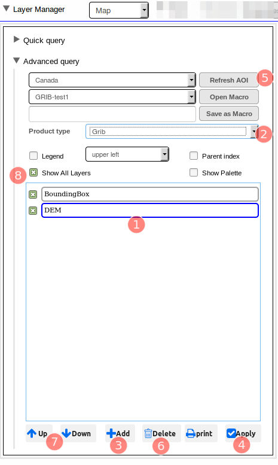
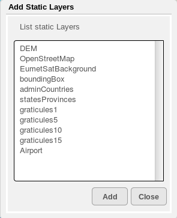
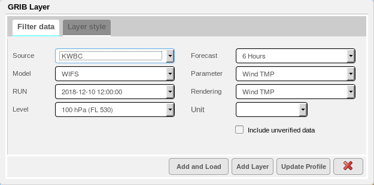
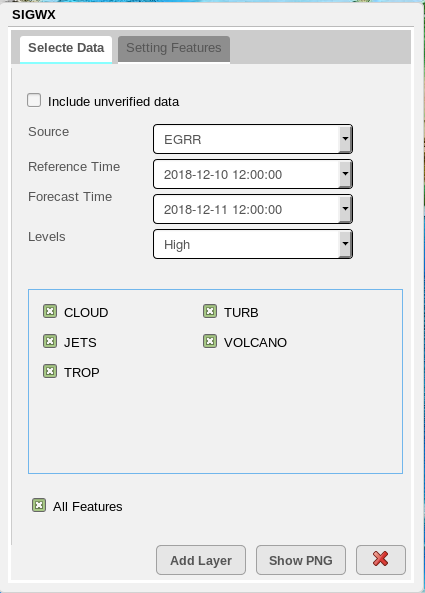
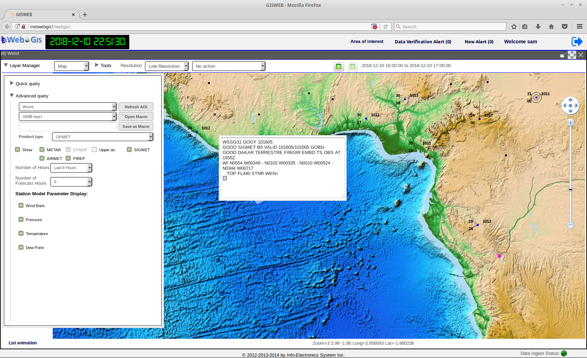
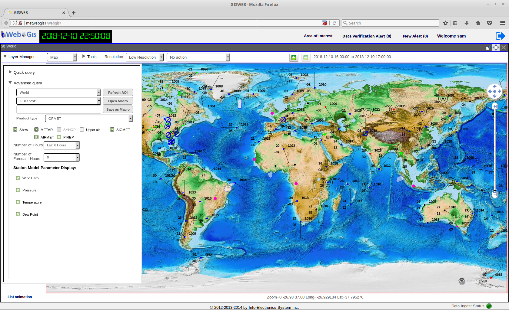
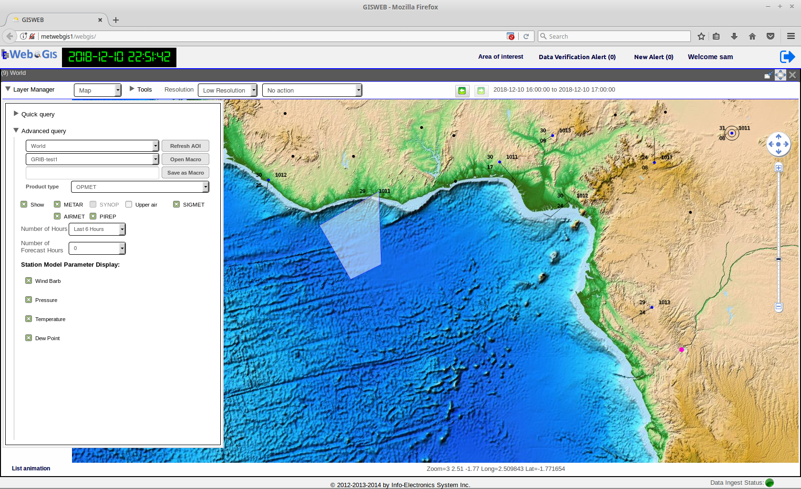
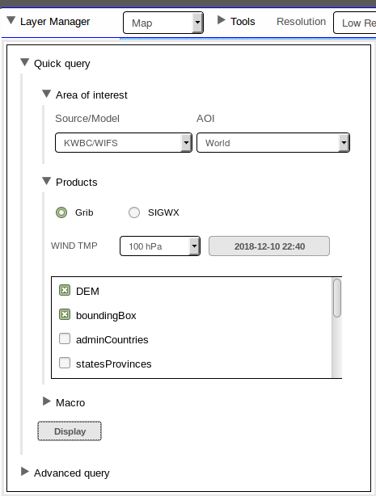

Map
===

The Map application module is the foundation module of WebGIS as a GIS web-mapping visualization software.
The main functionalities provided by the Map application include:

* Providing easy navigation over maps of a defined area of interest.
* Visualizing various geo-spatial data and meteorological products on a projected map.
* Organizing the different mapped GIS data as layers and providing user-friendly interactivity for managing and customizing their display.
* Providing different methods of rendering(such as isolines and filled-contours) of the data layers and geo-spatial data.

|
|
|
|
|
|
|
|
|
|
|
|
|

The Basics
**********

Layer Manager
-------------

The main components of the Map module consists of the **Layer Manager** and the **Main Data Display Pane**.
The Layer Manager is the component the user interacts with to control what data to display and how to display
on the Main Data Display Pane.

   Layer Manager with Advanced Query open and Layers List Box pre-loaded with the default layers, DEM and Bounding Box.

.. table:: Interface Description
   :widths: 8 50
   :align: left

   =========  ===========================================================
     no.      component description
   =========  ===========================================================
   **1**      **Layers List Box**
   **2**      **Product Type Selector**
   **3**      **Add Layer Button**
   **4**      **Apply Display Button**
   **5**      **Delete Layer Button**
   **6**      **AOI Selector & AOI Refresh Button**
   **7**      **Layer Up/Down Buttons**
   **8**      **Show All Layers Toggle**
   **9**      **Quick Query/Advanced Query Toggle**
   =========  ===========================================================

The Layer Manager serves as the control centre for user to query data layers and manages the layers displayed on the Main Data Display Pane.
As layers are added, they appear in a ordered list in the Layers List Box. All the layers appearing in the List Box are displayed as overlay layers.

The order in which the layer appears in the Layers List Box directly represents the order at which the layer is being rendered on the Main Data Display Pane.
The bottom-most layer in the List Box is the layer rendered on the background layer; the next layer up in the List Box , when rendered on the Display Pane, 
is overlaying over the previous layer; and the top-most layer in the List Box is the layer rendered as the foreground layer. 
The **Layer Up/Down Buttons** allows user to move the selected layer up or down as to alter its overlay order when rendered on the Main Data Display Pane.

Main Data Display Pane
----------------------

The Main Data Display Pane is the display area on which mapped data are presented.
Upon first log-in, it is always displays a map of the default Area Of Interest since the Layer Manager is by default pre-loaded 
with the DEM layer corresponding to this default Area of Interest. To learn how to change the user default Area Of Interest, please see Chapter 3.

Panning and zooming over the Area Of Interest is provided to the user for easy navigation and observation of the map.
Scrolling the mouse wheel up and down allows zooming-in and out of the map region, while clicking-and-dragging on the map provides panning of the region.
Alternatively, you can use the Map Navigation Control located on the right side of the map for zooming and panning. Clicking on the + and - is zooming
in and out respectively and clicking on an arrow key is panning the map in the respective direction by one step.

Adding Static Layer
-------------------

As mentioned earlier, the Layer Manager is pre-loaded with two default layers: the DEM and Bounding Box.
Both of these layers are static layers, which are geo-referenced layers that do not contain any temporal data.

To add a static layer to the display, use the **Product Type Selector** to select *Static Layer* as the Product type 
and click on the **Add Layer Button**. The Add Static Layers dialog appears. All the available static layers will be listed in this dialog.
Select the one to be added, and click Add. The added static layer will appear in the **Layers List Box** together with the other two default layers.
To refresh the display of all the static layers on the **Main Data Display Pane**, click on **Apply Display Button**.
 

.. Need figure showing the display of static layers

Adding a GRIB Layer
*******************

To add a new GRIB data layer, using the **Product Type Selector**, select GRIB as the Product type and click on the **Add Layer Button**.
The following GRIB Layer dialog appears.  

  
   The GRIB Layer Dialog

   

Different Rendering Types
-------------------------

Adding a SIGWX Layer
********************

To add a new SIGWX data layer, using the **Product Type Selector**, select SIGWX as the Product type and click on the **Add Layer Button**.
The following SIGWX Layer dialog appears.  

   The SIGWX Layer Dialog

Adding Opmet Data
*****************

Station Models plotting and other OPMET Data can also be displayed as overlay on top of the map data.
To overlay Station Models and other OPMET data on the map, under the **Product Type** drop-down list, select OPMET
and the following will appear in the Layer Manager.

   Querying OPMET Data for map display

   Querying OPMET Data for map display

   Station Models displayed on the Map

   Station Models displayed on the Map

   SIGMET Data on the Map

Quick Query Dialog
******************

By default, upon first login, the **Layer Manager** opens with the **Advanced Query Dialog** expanded while keeping the **Quick Query Dialog** in the collapsed state.
The **Quick Query Dialog** is located above the Advanced Query Dialog and is in the collapsed state whenever the Advanced Query Dialog is expanded.
Only either one of two dialogs can be used at one time. To use the **Quick Query Dialog**, click on the arrow next to the **Query Query** label to expand it. This also toggles
the Advanced Query dialog to collapse. 

In general, the **Quick Query** is compact and customized version of the **Advanced Query Dialog** and provides a subset of query functionalities available from the Advanced Query.
It is intended to provide a easy and quick way to query the most common types of WAFS products for display on the Map, 
while any data queries done using the Quick Query Dialog can also be done already with the Advanced Query Dialog.

   The Quick Query Dialog 

.. table:: Interface Description
   :widths: 8 50
   :align: left

   =========  ===========================================================
     no.      component description
   =========  ===========================================================
   **1**      **UTC Time Clock**
   **2**      **User Name Display**
   **3**      **Logout Button**
   **4**      **Area Of Interest Management Tool**
   **5**      **Data Verification Panel Toggle**
   **6**      **New Alert Panel Toggle**
   **7**      **Status Bar**
   **8**      **Application Module Selector**
   **9**      **Layer Manager**
   **10**     **Main Data Display Pane**
   =========  ===========================================================

