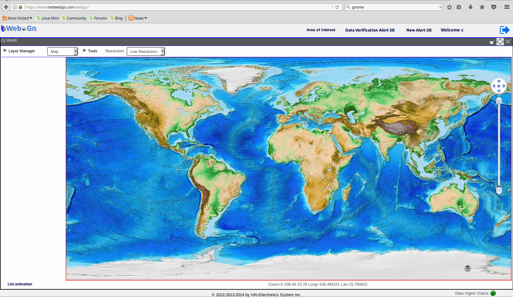

Map Module
==========

The Map application module is the foundation of WebGIS as a web-mapping visualization software.
It allows visualization of various WAFS geo-spatial data to be rendered on a projected map.
It organizes mapped data as layers and provides management of layers using interactive user-friendly control methods.
It provides navigation of the mapped data on the map.

The Basics - Panning and Zooming
********************************

Selecting Product Type
----------------------

The Map Module allows visualization of meteorlogical products on a map.
Many of the aviation products such as GRIB, SIGWX and OPMET can all be displayed using the Map module.

   This is the caption of the figure (a simple paragraph).

To deploy a new version of MetWebGIS, you will need the WAR file containing the application.
The WAR file needs to be deployed in an Tomcat instance.
To do so, the easiest way is to use the HTML Manager of Tomcat.

.. code-block:: bash

   $ git clone https://github.com/cehbrecht/quick-sphinx-tutorial.git

Adding a new Layer
------------------

To add a layer to the Layer Manager, simply click on the + button.

Adding a GRIB layer
~~~~~~~~~~~~~~~~~~~

Adding a SIGWX layer
~~~~~~~~~~~~~~~~~~~~~

GRIB data query
***************

This section talks about the details of the GRIB2 data query.
``systemctr restart tomcat8`` you have the ``SIGWX``
