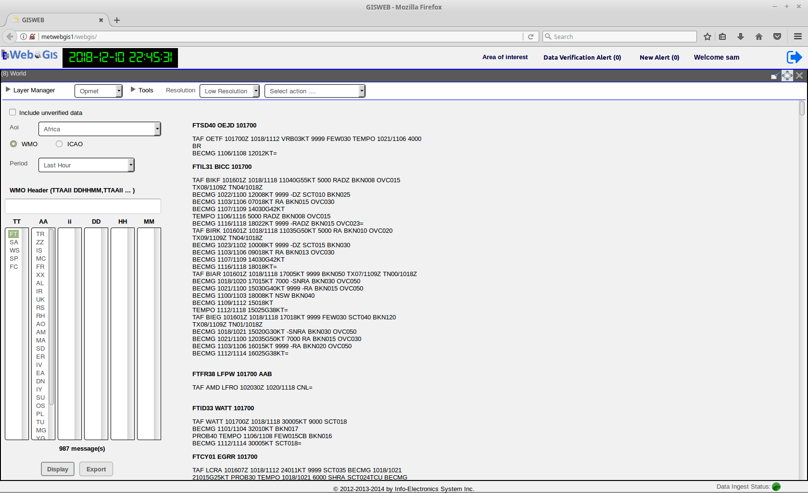
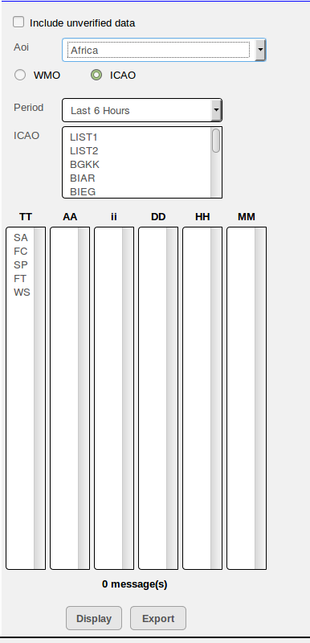

Opmet
=====

The Opmet module is used for querying WMO alpha-numeric bulletins such as METAR, TAF, SIGMET, etc.
The data retrieval is based on a set of query criteria.

To use the 

.. figure:: images/gui_opmet_module1.png
   
   Caption

Query by WMO Header
*******************

.. figure:: images/opmet_query_dialog_wmo.png
   
   Querying OPMET Data Using the WMO Header

   
   Display of the WMO Bulletins

.. figure:: images/opmet_bulletin_display2.png
   
   Display of the WMO Bulletins

Query by ICAO Code
******************

The query criteria contains with the following.
AOI drop-down list 
Query based on WMO header or ICAO ID

   
   Querying OPMET Data Using the ICAO Code

The AOI drop-down list contains a list of all the pre-defined Areas of Interest(AOI's).
(For defining a custom Area of Interest, please read the secion on Creating an Area Of Interest)
  
