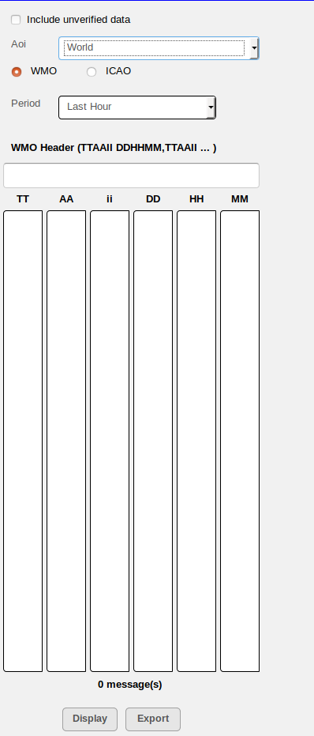

Opmet
=====

The Opmet module is application module used for the querying and display of standard WMO bulletins such as METAR, TAF, SIGMET in alpha-numeric format.
The data retrieval is based on querying criteria using either WMO Header or the ICAO code of the OPMET message.

When the OPMET module is first opened, the user is presented with the following OPMET Data Selection Panel.

   The OPMET Data Selection Panel

This panel allows user to filter out data for display either by using the WMO Header or the ICAO Code of the OPMET message.
By default, the radio button of **WMO** is selected and **ICAO** is un-selected as shown in the figure.

Query by WMO Header
*******************

First, click on the **WMO Radio Button** to enable query by WMO Header
When it is enabled, the query criteria contains with the following: **AOI, Period, WMO Header**

In the drop-down list **AOI**, click on the AOI within which the queried OPMET data should be found.
In the drop-down list **Period**, click to select how many hours in the past to include.
Then in the text field, enter part of the WMO Header to match for.  
Once these selections are made, all the available matching OPMET data will be listed in the columns below which are ordered according 
to the WMO Header code sequence **TT AA ii DD HH MM.**
If this **WMO Header** text field is left blank, all the available OPMET data will be listed in the columns below.

Further filtering can be done by clicking on the particular part of the WMO Headers appearing in the columns.
Once user is satisfied with the selection, click on the **Display Button** to display the selected OPMET bulletins on the Main Data Display Pane on the right.

   
   OPMET Data Selection Panel with query by WMO enabled.

Query by ICAO Code
******************

First, Click on the **ICAO Radio Button** to enable query by ICAO Code
When it is enabled, the query criteria contains with the following: **AOI, Period, ICAO Code**

In the drop-down list **AOI**, click on the AOI within which the queried OPMET data should be found.
In the drop-down list **Period**, click to select how many hours in the past to include.
Then in the **ICAO List Box**, click to select the specific ICAO Code to match.  
Once these selections are made, all the available matching OPMET data will be listed in the columns below which are ordered according 
to the WMO Header code sequence **TT AA ii DD HH MM.**

Further filtering can be done by clicking on the particular part of the WMO Headers appearing in the columns.
Once user is satisfied with the selection, click on the **Display Button** to display the selected OPMET bulletins on the Main Data Display Pane on the right.

   
   OPMET Data Selection Panel with query by ICAO enabled.

.. figure:: images/opmet_bulletin_display1.png
   :width: 500
   
   Display of the WMO Bulletins

.. figure:: images/opmet_bulletin_display2.png
   :width: 500
   
   Display of the WMO Bulletins

.. figure:: images/gui_opmet_module1.png
   :width: 500
   
   GUI of the Opmet Module

Exporting the OPMET Data
************************

The display of the OPMET data resulting from the query can be exported as a text file for offline use and/or printing.
Following the steps in the previous sections to make the OPMET data query.
Then click on the **Export Button** at the bottom of the OPMET Data Selection Panel.
An exportable text file will then be generated and presented on a separate browser tab.
Using the menus from a standard browser, the user can choose to either save it for offline storage or send it to the printer for print.

