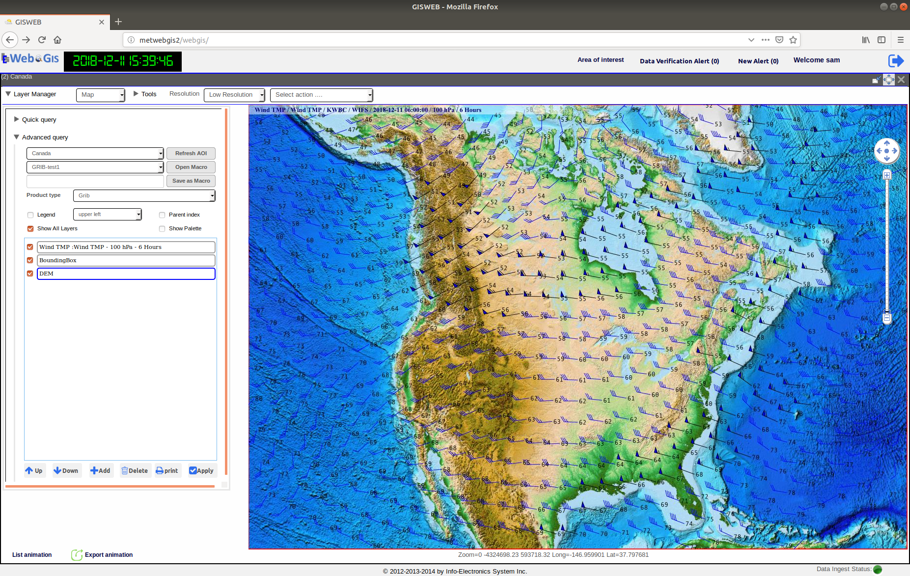

Software System Overview
========================

.. 2nd Level Heading

Overall Software Description
****************************

The MetWebGIS system is a web-based WAFS system based on the client-server design model.
On the server side, all the data are automatically fetched from the WAFS sources such as WIFS or SADIS via the Internet.
As soon as data are fetched onto the server, data processsing and ingestion are then performed to prepare, 
database and enable them for use by the web application.
The front-end WebGIS application is fully web-based which allows its Graphical User Interface to run from an 
ordinary browser on any client computer connected to the same network.

   Figure 1: Graphical User Interface of WebGIS running from a client browser.

